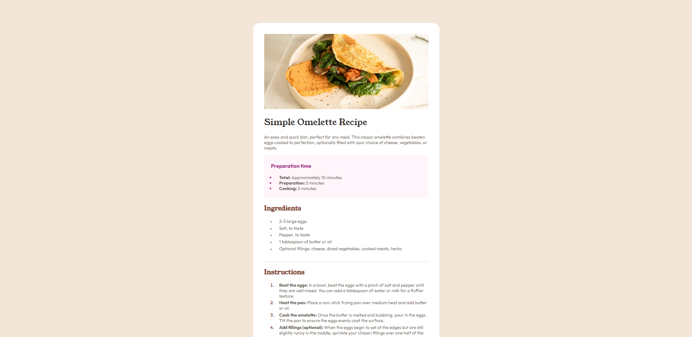
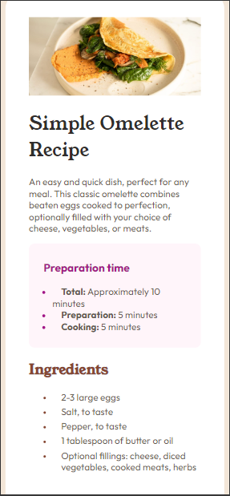

# Front end Mentor Challenge

Based on challenge in <a href="https://www.frontendmentor.io/challenges/recipe-page-KiTsR8QQKm">Here</a>

## Finished project

## Mobile View

## What i'm learning

<ul>
<li>
    HTML Structure
</li>
<li>
    CSS Styling
</li>
<li>
    Table tags
</li>
</ul>